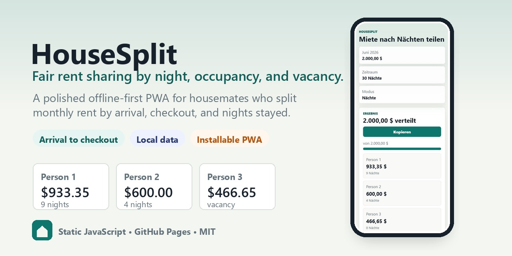
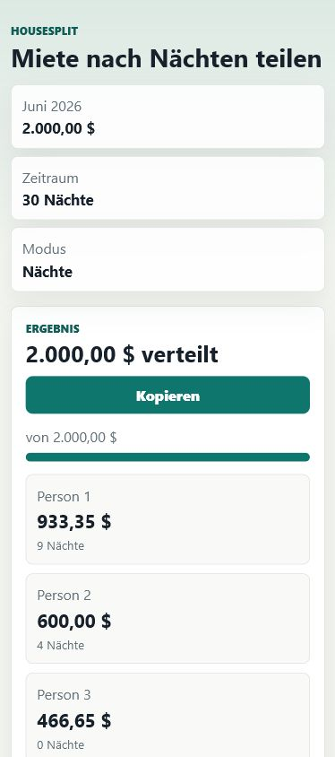

[](https://n0ahtm.github.io/HouseSplit/)
[](https://github.com/N0ahTM/HouseSplit/releases/latest)
[](LICENSE)
[](https://developer.mozilla.org/en-US/docs/Web/JavaScript)

<p align="center">
  
</p>

<p align="center">
  <a href="https://github.com/N0ahTM/HouseSplit">
    
  </a>
</p>

HouseSplit is a small mobile-first rent calculator for housemates. It splits a monthly rent by nights stayed and by the number of people present each night, so solo nights, shared nights, and vacancy nights are handled explicitly.

Open the live app: **[n0ahtm.github.io/HouseSplit](https://n0ahtm.github.io/HouseSplit/)**

Built with **plain JavaScript**, **HTML**, and **CSS**. No backend, no accounts, no build step.

## Quick Start

1. Open [HouseSplit](https://n0ahtm.github.io/HouseSplit/) on your phone.
2. Enter the monthly rent, month, currency, and housemates.
3. Add arrival and checkout dates for each person's stays.
4. Choose how empty nights should be handled.
5. Copy the summary and send it to your group chat.

On iPhone or Android, add the site to your home screen to use it like a small app. See [Usage](docs/USAGE.md).

## Features

- Mobile-first interface for iOS and Android browsers.
- Installable PWA when opened from the GitHub Pages HTTPS URL.
- Per-person stay ranges with multiple ranges per person.
- Nightly rent splitting by actual occupancy.
- Vacancy handling: show separately or distribute across all people.
- Exact cent-based rounding so totals remain consistent.
- Shareable text summary for messages.
- Local browser storage only.
- Offline support after the first hosted load.
- Single-file offline copy can be generated locally for file sharing.

## Calculation Model

HouseSplit first splits the monthly rent across every night in the selected month. Arrival dates count; checkout dates do not count. For each night:

- if one person is present, that person pays the full nightly amount;
- if multiple people are present, the nightly amount is split equally;
- if nobody is present, the amount is either shown as vacancy or split across all people, depending on the selected setting.

The app calculates in cents and distributes rounding leftovers deterministically.

## Preview

<p align="center">
  
</p>

## Development

Run locally with any static server:

```powershell
python -m http.server 4173
```

Then open:

```text
http://localhost:4173
```

Run checks:

```powershell
npm test
npm run check
```

## Documentation

- [Usage](docs/USAGE.md)
- [Development](docs/DEVELOPMENT.md)
- [Privacy](docs/PRIVACY.md)
- [Changelog](CHANGELOG.md)

## Privacy

HouseSplit stores data locally in your browser. It does not send rent data, names, dates, or calculations to a server. See [Privacy](docs/PRIVACY.md).

## License

MIT License. See [LICENSE](LICENSE).
